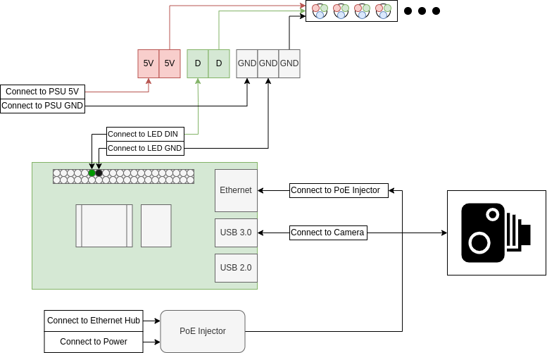

Setting up Docker context

https://www.youtube.com/watch?v=YX2BSioWyhI

https://code.visualstudio.com/docs/containers/ssh
```bash
ssh-keygen
```

## EOAT Hardware Setup



## Install Ubuntu Server 22.04

Install Raspberry Pi Imager

[Windows or macOS](https://www.raspberrypi.com/software/)

Debian
```bash
sudo apt install rpi-imager
```

1) Open Raspberry Pi Imager

2) Select operating system:
Choose OS -> Other General Purpose OS -> Ubuntu -> Ubuntu Server 22.04 LTS (64-bit).

3) Select storage device for OS.

4) Click on settings icon in bottom right and use [this configuration](docs/imager_settings.png).

5) Flash device

Insert micro SD card into Raspberry Pi and connect to power. To perform the rest of the setup, we need to get the Pi's IP so we can connect. To find this, connect the Pi to a keyboard and monitor. Login and run the following commands:

```bash
sudo apt install net-tools
ifconfig
```

Make note of the ip of the form 192.168.1.x.

## EOAT Setup

### SSH into Pi

```bash
ssh pi@192.168.1.x
```

Type "yes" if asked to verify signature of device. Input password to login. In the future you should be able to SSH using the hostname of the Pi with the command `ssh pi@inspectioneoat.local`

### Install docker
[Install Docker](https://docs.docker.com/engine/install/ubuntu/#install-using-the-convenience-script)
```bash
curl -fsSL https://get.docker.com -o get-docker.sh
sudo sh ./get-docker.sh
sudo groupadd docker
sudo usermod -aG docker $USER
newgrp docker
docker run hello-world
```
If install was successful, you should see [this output](docs/docker_install_output.png) after running the last command.


### Clone repository
```
git clone https://github.com/cacton77/inspection_eoat.git
```

Build Image
```bash
cd inspection_eoat
docker compose build
docker compose up xxxx
```
